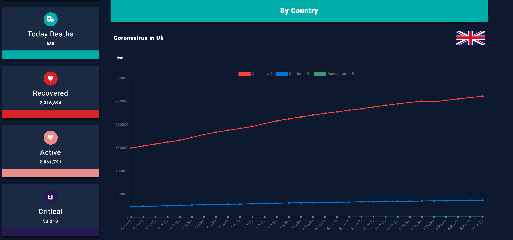
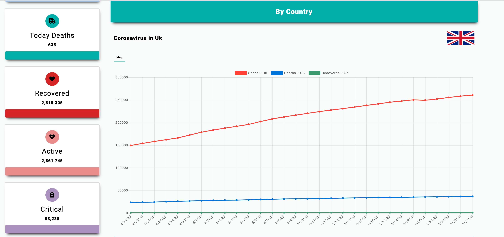

[Check out the site here - https://coronavirus-covid19-stats.herokuapp.com/](https://coronavirus-covid19-stats.herokuapp.com/)

### **Description**

A Covid-19 Coronavirus dashboard that displays daily data pulled from the [NOVELCovid Public API](https://disease.sh/docs/). Find the daily stats for worldwide data as well as searching by the specific country. The returned data is outputted in text, graphical and a Geolocatiton format.

### **Technologies**

- Vanilla JavaScript

### **Libraries**

- [Leafletjs](https://leafletjs.com/)
- [Express](https://expressjs.com/)

### **Features**

- daily stats
- Search by specific Country
- Charts
- Dark mode 😎

### **How to use**

### Node

```
npm init
```

```
npm start
```

#### Docker

```
# Build the docker file
docker build -t coronavirus-stats .
```

```
# run the docker file
docker container run -p 3000 coronavirus-stats
```

### **API Reference**

#### NOVEL COVID API

[Homepage - https://disease.sh/](https://disease.sh/)

[Docs - https://disease.sh/docs/](https://coronavirus-covid19-stats.herokuapp.com/)

[GitHub - https://github.com/NovelCovid/API](https://github.com/NovelCovid/API)
